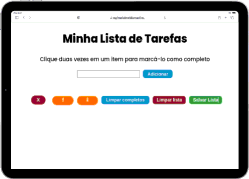

## Hi, i'm Elias

  
  

    <li> 💚 I'm studying Web Development at <a href="https://betrybe.com">Trybe</a></li>
    <li> 💎 Level: Student
    <li> 🏆 Learning Front-end</li>
    <li> 💪🏼 My future goals: to continue in constant study to keep up with the technologies.
    <li> ⚡ Fun fact: One Piece is my favorite anime  
  

---

### Technologies and Tools 🛠️

  
  
  
  

---

### Contact 📝

   

  

<h1 align="center">Main Projects</h1>
  

<table>
  <tr>
    <td valign="top" width="50%">
      <h2 align="center"><a href="https://eliasef.github.io/to-do-list/">To-Do List</a></h2>
      
       
       
      
<em><strong>:wrench: Tools/Methodologies:</strong> HTML, CSS, JavaScript, LocalStorage</em>

      
:us: To-Do List project to save lists in browser, delete and clear them.

      
:brazil: Projeto de To-Do List para salvar listas no navegador, excluir e limpá-las.

    </td>
</table>
 
  

  

 
     

    

