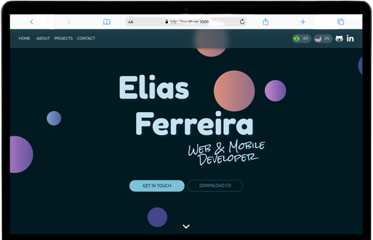
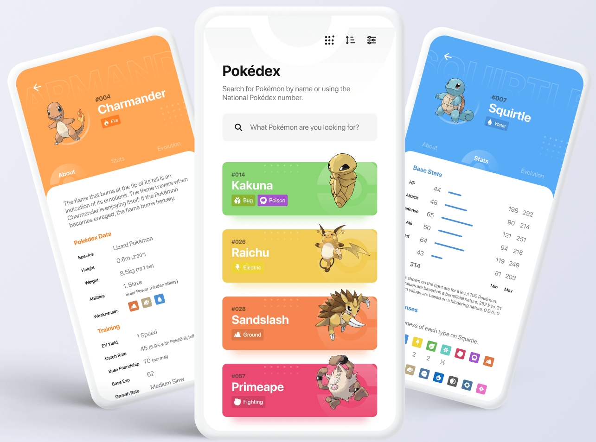
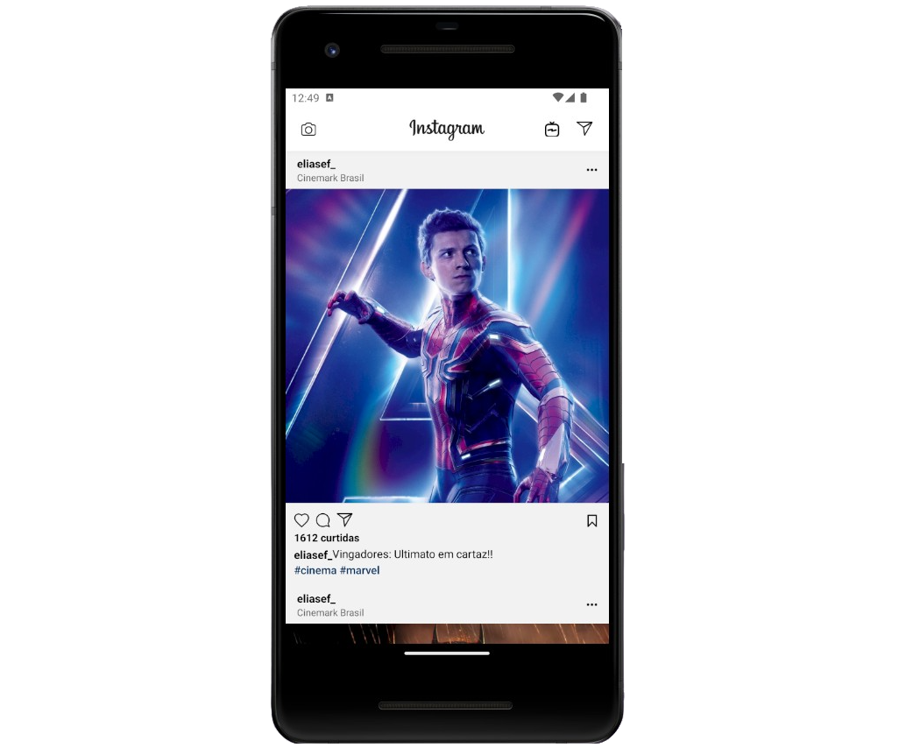
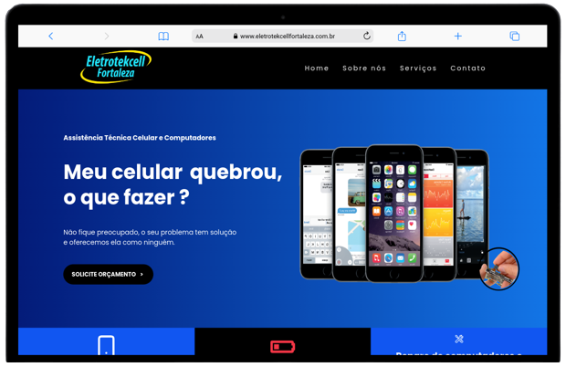

# Hello!

```js

const skills = {
  frontend: [Javascript, HTML, CSS, React Native, Redux, Context API, Typescript, Git, Browser Router, RTL, Jest, Bootstrap],

  backend: [Docker, MySQL, Node, Express.js],

  metodologiasAgeis: [Scrum, Kanban]
};

var aboutMe = {
  aprendendo: 'Aprofundando-se em projetos Frontend',
  interesse: 'FrontEnd Web e Mobile'
};


```

---

<h1 align="center">Skills</h1>


  
---

<h1 align="center">Main Projects</h1>

<div align="center">
<table>
  <tr>
   <td valign="top" width="50%">
      <h2 align="center"><a href="https://github.com/eliasef/uber-clone">Uber Clone</a></h2>
      <a href="https://github.com/eliasef/uber-clone"></a>
      <br>
      <br>
      <p><em><strong>:wrench: Tools/Methodologies:</strong> React Native, Redux Toolkit, API Google Autocomplete, React Navigation, Javascript, HTML, Tailwind CSS, Functional Components, React Hooks, Expo. </em></p>
      <p>:us: App to order Uber, see the total distance and time and how much you have to pay.
      <p>:brazil: App para pedir Uber, ver a distância e tempo total e quanto você tem que pagar.</p>
    </td>
    <td valign="top" width="50%">
      <h2 align="center"><a href="https://github.com/eliasef/api-pokedex">Portfolio</a></h2>
      <a href="https://github.com/eliasef/api-pokedex"></a>
      <br>
      <br>
      <p><em><strong>:wrench: Tools/Methodologies:</strong> React (functional components), Context API, HTML, CSS, Material UI, JavaScript</em></p>
      <p>:us: My personal portfolio.</p>
      <p>:brazil: Meu portfólio pessoal.</p>
    </td>
    </tr>
    <tr>
      <td valign="top" width="50%">
      <h2 align="center"><a href="https://github.com/eliasef/api-pokedex">Pokédex API</a></h2>
      <a href="https://github.com/eliasef/api-pokedex"></a>
      <br>
      <br>
      <p><em><strong>:wrench: Tools/Methodologies:</strong> React Native, Typescript, Axios, React Hooks & Props, Functional Components, HTML, CSS, React Navigation, Styled Components, Reanimated V2, Expo.</em></p>
      <p>:us: App to list, search and see attributes of pokemons.</p>
      <p>:brazil: App para listar, pesquisar e ver atributos de pokémons.</p>
    </td>
      <td valign="top" width="50%">
     <h2 align="center"><a href="https://github.com/eliasef/insta-clone">Instagram Clone</a></h2>
      <a href="https://github.com/eliasef/insta-clone"></a>
      <br>
      <br>
      <p><em><strong>:wrench: Tools/Methodologies:</strong> React Native, React Hooks & Props, Functional Components, React Navigation, Styled Components, Javascript, HTML, CSS, Expo.</em></p>
      <p>:us: Application that lists posts just like Instagram.</p>
      <p>:brazil: Aplicativo que lista posts assim como o Instagram.</p>
    </td>
    <tr>
      <td valign="top" width="50%">
      <h2 align="center"><a href="https://www.eletrotekcellfortaleza.com.br/">Eletrotekcell</a></h2>
      <a href="https://www.eletrotekcellfortaleza.com.br/"></a>
      <br>
      <br>
      <p><em><strong>:wrench: Tools/Methodologies:</strong> React.js, React Router V6, React Hooks, Javascript, HTML, CSS, Git, JSX.</em></p>
      <p>:us: A Landing Page project from a company called Eletrotekcell.</p>
      <p>:brazil: Um projeto de Landing Page de uma empresa chamada Eletrotekcell.</p>
    </td>
    <td valign="top" width="50%">
        <h2 align="center"><a href="https://eliasef.github.io/pokedex/">Pokédex Web</a></h2>
      <a href="https://eliasef.github.io/pokedex/"></a>
      <br>
      <br>
      <p><em><strong>:wrench: Tools/Methodologies:</strong> HTML, CSS, JavaScript, UI interface.</em></p>
      <p>:us: Pokemóns card made with Js and UI design.</p>
      <p>:brazil: Cards de Pokémons feito com Js e UI design.</p>
    </td>

</table>
<br>
  </div>

---

<h1 align="center">GitHub Statistics</h1>

<div align="center"> 
     <a href="https://github.com/eliasef">
  
</a>
<a href="https://github.com/eliasef">
  
</a>
  <a href="https://git.io/streak-stats">
    
  </a>
    


  </div>
  

<div align="center">
   <a href="https://www.linkedin.com/in/eliasef/" target="_blank"></a>
<a href = "mailto:eliasef0305@gmail.com"></a>
 
<p>Profile views since 12/31/2021:</p>
    <p></p>
  </div>
  
   
    
 
