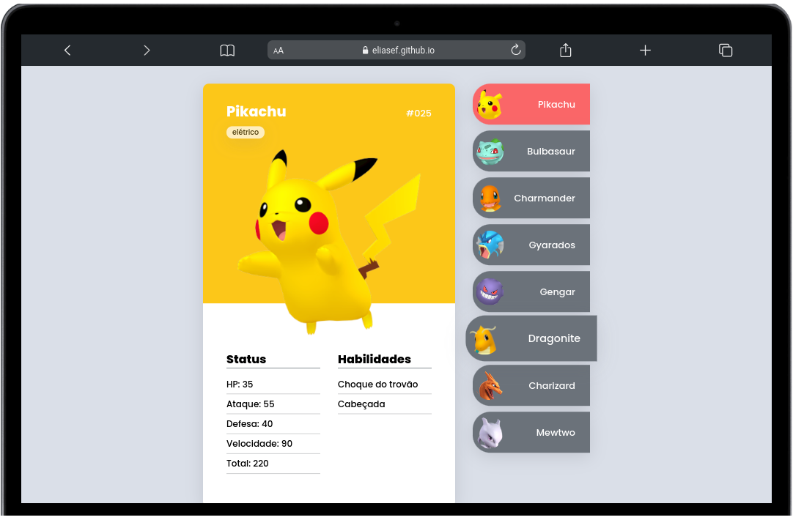

## Hi, i'm Elias

  
  

    <li> 💚 I'm studying Web Development at <a href="https://betrybe.com">Trybe</a>.</li>
    <li> 💎 Level: Student.
    <li> 🏆 Learning Front-end.</li>
    <li> 💪🏼 My future goals: to continue in constant study to keep up with the technologies.
    <li> ⚡ Fun fact: One Piece is my favorite anime  .
  

---

### Technologies and Tools 🛠️

  
  
  
  
  
  
  
  

---

### Contact 📝

   

  

<h1 align="center">Main Projects</h1>
  

<table>
  <tr>
   <td valign="top" width="50%">
      <h2 align="center"><a href="https://eliasef.github.io/pokedex/">Pokédex</a></h2>
      
       
       
      
<em><strong>:wrench: Tools/Methodologies:</strong> HTML, CSS, JavaScript, UI.</em>

      
:us: Pokédex project with cards showing 8 pokémons, with interactivity and UI interface.

      
:brazil: Projeto Pokédex com cards exibindo 8 pokémons, com interatividade e interface UI.

    </td>
    <td valign="top" width="50%">
      <h2 align="center"><a href="https://eliasef.github.io/calculator/">Trybeflix</a></h2>
      
       
       
      
<em><strong>:wrench: Tools/Methodologies:</strong> React (functional components), Redux, HTML, CSS, JavaScript.</em>

      
:us: Trybeflix is a Redux project where I learned store manipulation concepts, through dispatch, action, reducer, state and store.

      
:brazil: Trybeflix é um projeto Redux onde aprendi conceitos de manipulação de loja, através de dispatch, action, reducer, state e store.

    </td>
    </tr>
    <tr>
    <td valign="top" width="50%">
      <h2 align="center"><a href="https://eliasef.github.io/calculator/">Calculator</a></h2>
      
       
       
      
<em><strong>:wrench: Tools/Methodologies:</strong> React (functional components), HTML, CSS, JavaScript.</em>

      
:us: Calculator project, being able to add, subtract, multiply and divide.
      
:brazil: Projeto de calculadora, podendo somar, diminuir, multiplicar e dividir.

    </td>
    </tr>
</table>
 
  

  

 
     

    

